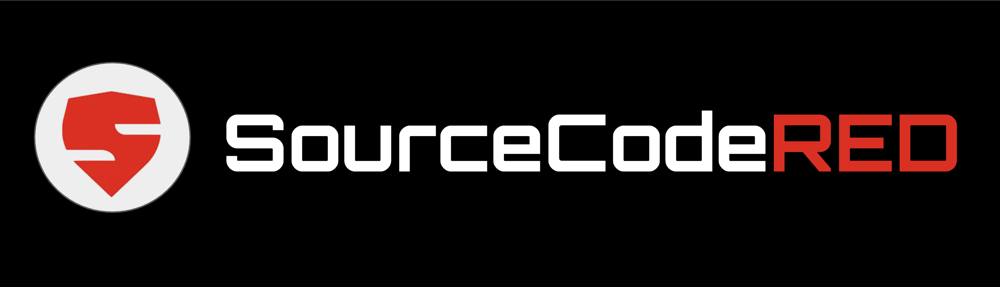

# Red Teaming the software supply chain - 1 day event

### All content is copyright Paul McCarty 2024

### Your Trainer

Paul McCarty
Contact Details:  paulm@sourcecodered.com and my GitHub handle is [6mile](https://github.com/6mile). 

### Things to know before starting

1. I've tried really hard to give you a good foundation of software supply chain offensive operations in one day.  Of course, its actually impossible to do that and to make the course fun and palatable, so I've tried really hard to find a balance.  If you want more in depth training, I offer longer private engagements. 
2. This class has an offensive security focus but also has a lot to offer to software engineers and defenders as well.  Please don't feel like you need to have an offensive security background to get something from this class.  I will talk to the different roles and personas in the class.
3. Please bring a laptop that you can do "hackery" stuff on.  Usually there are a couple people in each class that bring work laptops that won't let them do the stuff they need to do like install npm packages, or use Google drive, or whatever.  So I suggest you bring a personal laptop that you have administrative permissions on.  It's not fair to the rest of the attendees if I have to troubleshoot one person's computer all day.
4. If you don't have a GitHub account, please [sign up](https://github.com/join) for one before the training.  If you aren't familiar with GitHub you can check out this [intro to GitHub](https://docs.github.com/en/get-started/start-your-journey/hello-world).  If you want to send me your GitHub username before the training starts I can add you to the repo ahead of time.  
5. Please have [git](https://git-scm.com/book/en/v2/Getting-Started-Installing-Git), [node and npm](https://nodejs.org/en/download/package-manager) installed before the class.  If you have issues I can help you before class starts to get these tools installed and working.
6. It's not strictly necessary, but having other tools like [Python 3](https://www.python.org/downloads/), [pip](https://pip.pypa.io/en/stable/installation/), Project Discovery's [Nuclei](https://github.com/projectdiscovery/nuclei), [Chaos](https://docs.projectdiscovery.io/tools/chaos/install), [httpx](https://github.com/projectdiscovery/httpx), [dnsx](https://github.com/projectdiscovery/dnsx) and [subfinder](https://github.com/projectdiscovery/subfinder); as well as other tools like [Trufflehog](https://github.com/trufflesecurity/trufflehog), [Gitleaks](https://github.com/gitleaks/gitleaks), [Semgrep](https://github.com/semgrep/semgrep), and [Trivy](https://github.com/aquasecurity/trivy) installed helps too.  Feel free to have a play around with them as well.  
7. I use a Mac and/or Linux but if you've got a Microsoft operating system, I highly suggest you install "Windows Subsystem for Linux" or WSL.  You can read about WSL [here](https://learn.microsoft.com/en-us/windows/wsl/install) .  Alternatively, you can install a VM or work out of another online or cloud server.  
8. At the end of the session you will get a physical certificate saying you completed the training.  If you want a different name on the certificate please respond to this privately and let me know.

### The Detailed Outline for the Training

1. Training introduction - 30 minutes
   1. Goals of this training
   1. Make sure we have requirements in place
   1. Main takeaways from this workshop
   1. Who is the audience for this course?
2. Your instructor - 15 minutes
   1. Paul bio
   1. Open source projects I work on
   1. Where you can find me
3. Glossary - 15 mins
4. What is a Red Team? - 30 mins
   1. What does a traditional red team do?
   1. What does an evolving red team do?
   1. How do penetration testing, red teaming and bug bounty programs co-exist?
5. What is the software supply chain (SSC)? - 45 minutes
   1. What components make up the SSC
   1. What’s in your software supply chain? - [EXERCISE](https://docs.google.com/forms/d/e/1FAIpQLSe1JU9stBqd_fMRXl81wwG_DP04pFp5KWOCDgLPS0jsSuolRA/viewform?usp=sf_link)
   1. Why do we need to attack & defend this supply chain?
      1. Attacks on the SSC are increasing
      1. Applications are getting more complex with more moving pieces
   1.  What is CI/CD and why is it important?
   1.  Talk about how the applications we are building today are materially different, and more complex than earlier applications.
   1.  Introduce the [“Visualizing Software Supply Chain"](https://github.com/SecureStackCo/visualizing-software-supply-chain) project. The VSSC project helps people understand whats in scope visually.
   1.  Explain the ten stages of the SSC
   1.  Explain how all applications do NOT use all ten stages
   1.  Show the group how to asses an application using the VSSC project
   1.  Use MyGov as an example
6. Historical Attacks on the SSC - 30 minutes
   1. How attackers attack
   1. Your training/targeting perspective defines what the target is
   1. Recent history of SSC attacks
   1. Package ecosystem attacks:  npm, PyPi, DockerHub, RubyGems, etc
   1. XZ
   1. Dockerhub
   1. GitHub Forks Attack
   1. Malicious GitHub Attacks
   1. Malicious containers attacks
   1. Solarwinds
   1. Attacks on software developers
7. Gaining visibility into your SSC - 30 minutes
   1. Use the VSSC project as the foundation
      1. Start with individual engineers and ask them to perform their own asset discovery process 
      1. Then run tabletop excercises with engineering teams
      1. Create lists, then when it matures, create maps
**BREAK FOR LUNCH**
8. Target, Value, Patterns & Objectives [TVPO](https://github.com/6mile/tvpo) - 30 minutes
   1. Target - Who or what is the focus of the offensive activities
      1. Is your target an application?  A company?  A open-source project?
   1. Value - The reason the target has been selected, or the benefit the target provides to an attacker
   1. Patterns - Repeated traits of an individual human, or an organization, that makes that target susceptible to attack.
      1. Common organizational Patterns
      1. Individual developer Behaviours
   1. Objectives - The timeline, goals, and outcomes that the attacker aims to achieve through the offensive operation.
9. Developer Sock Puppets - 45 mins
   1. Creating dev sock puppets
      1. Good name
      1. email
      1. phone number
      1. Paid account to unlock functions
      1. Photo or image
   1. Managing sock puppets
      1. Activity Graph - see [fake-git-history repo](https://github.com/artiebits/fake-git-history)
      1. member of organizations?
      1. Contributing to projects
         1. How to find good projects to contribute to
         1. Leverage projects to gain access to other projects
      1. correlate with other platforms: facebook, stackoverflow, reddit, etc
      1. Two types of puppets:  Long term and throw away
   1. Sock puppet networks
      1. Do your sock puppets co-exist for social proof?
      1. Are your sock puppets lone wolfs?  Social proof is lower.
      1. Managing networks is time intensive
   1. **EXERCISE**: Create your first sock puppet dev
10. Introducing [OSC&R framework](https://pbom.dev) - 15 mins
11. Build ecosystem clout - 30 mins
    1. Leverage code puppet network
    1. Use [Semgrep](https://github.com/semgrep/semgrep) to Find a bug in a repo and correct it.
    1. Create a PR
12. Package Ecosystem Attacks - 30 minutes
    1. Dependency confusion
       1. Identifying dependency confusion opportunities in npm
          1. npm - Use the [Confused library](https://github.com/visma-prodsec/confused)
          1. PyPI - You can use Confused for pip as well
          1. [DockerHub](https://www.errno.fr/DockerDependencyConfusion.html#im-using-docker-am-i-affected)
    1. Typosquatting
    1. Obfuscation
    1. Open-source package targeting
          1. OpenSSF [Scorecard](https://github.com/ossf/scorecard) - Helps you determine how secure is an open-source package?
          1. Developer identity hacking with [commit-audit](https://github.com/6mile/commit-audit)
13. Publish a malicious npm package - 60 mins
    1. What is your target? (use TVPO)
       1. Dependency confusion
       1. Typo-squat 
       1. Legitimate value?  ie., You aren't tricking target into installing.  Instead, you are giving something they want.
    1. Create a [npm account](https://www.npmjs.com/signup)
    1. Build a realistic npm package
       1. Use this [repository](https://github.com/sourcecodered/example-npm-package) to create first npm package
    1. Connect legitimate GitHub Repo in npm user profile
    1. Add collaborators 
    1. Learn how to create a package and publish
14. Research what the bad guys are doing so we can learn from them - 30 mins
    1. OSV
    1. GitHub Advisory Database (GHSA)
    1. PyPi Malicious Registry
15. Targeting Developers - 30 mins
    1. git level attacks
       1. Commit signing
    1. maintainers of packages
       1. account takeover
       1. account confusion
    1. collaborators
    1. Malicious GitHub apps
16. End of training:  receive swag and certificate!

